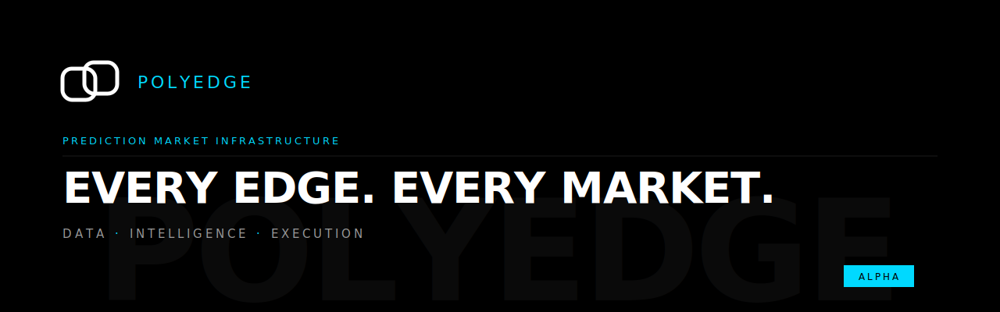

 

Prediction markets are maturing into a real financial domain, and the participants driving that growth — systematic traders, autonomous agents, and quantitative researchers — need infrastructure that treats it as one.
Raw venue feeds are fragmented and ungraded. Every serious builder ends up solving the same problems: normalizing schemas, reasoning about data quality, stitching history together, and computing the same indicators from scratch.
PolyEdge is the layer that handles it. Multi-venue coverage, graded quality, and the depth and consistency AI-agent and systematic workflows actually require.

ALPHA — FREE TIER LIVE
The free tier is live for early builders. Paid tiers are actively being hardened and will roll out over the coming weeks. Expect rough edges.
Feedback from early users shapes the product. Reach us on Discord or through the feedback channel.

Start building →
BUILT IN RUST

