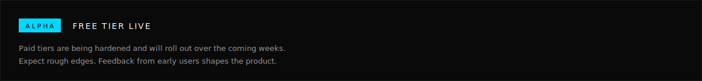

  

  
  &nbsp;
  
  &nbsp;
  

 

  

PolyEdge is the real-time infrastructure layer for prediction markets. Normalized, graded, multi-venue data today. Server-computed intelligence and execution infrastructure building toward the same surface.
Streaming, REST, and tick-level Parquet exports. Rolling compute, not batched queries. From the solo trader wiring up their first dashboard to the quant team ingesting at scale.
 

  

Real-time streaming. Direct WebSocket feeds, sub-second latency. No batching layer.
REST API. Full REST surface for on-demand queries.
Parquet exports. Tick-level historical data, natively columnar. Drop into DuckDB, Spark, or pandas without conversion.
Multi-venue. Unified schema. Polymarket, Kalshi, more coming.
Graded quality. Four-tier scoring on every market.
Server-computed indicators. EMA, RSI, MACD, VWAP, microstructure. Rolling, not recomputed per request.
Agent-native. Structured responses for LLM and systematic workflows.

 

  

 

  

